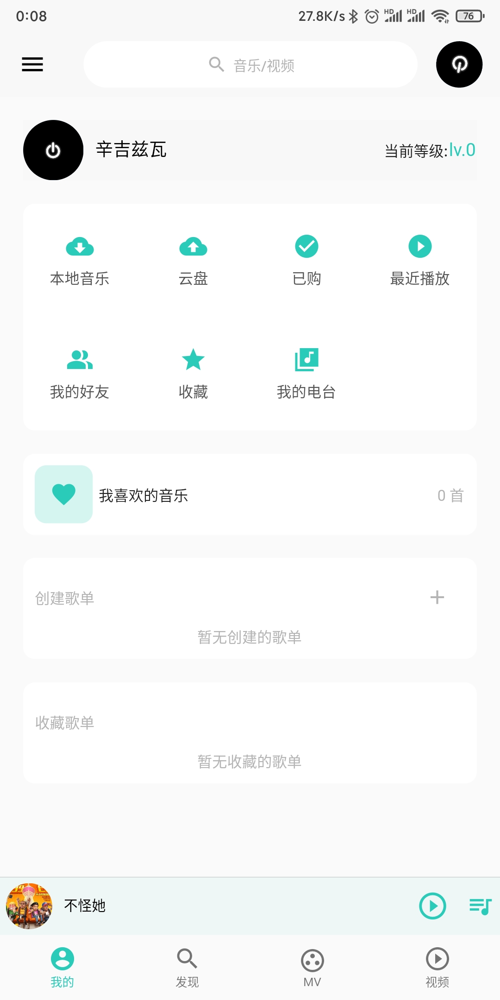
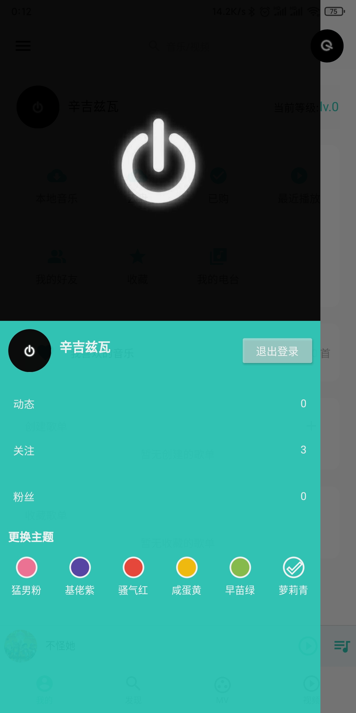
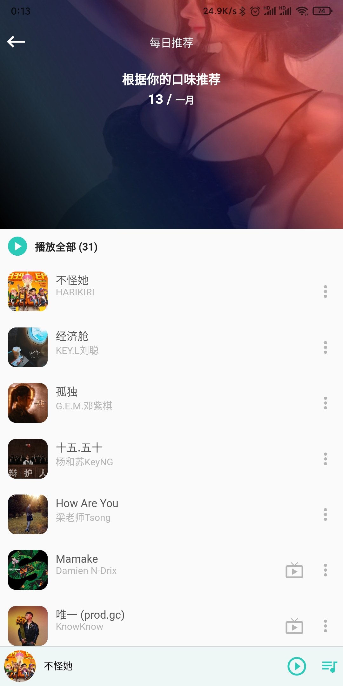
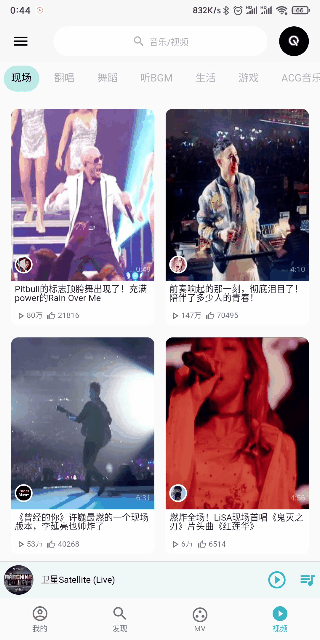

使用flutter模仿网易云音乐app

首先感谢binaryify，----[接口地址](https://github.com/Binaryify/NeteaseCloudMusicApi)

还有很多功能未完成，随机播放还可以再做完善，后续功能看情况是否继续开发。

# 运行项目
  - flutter pub get
  - flutter run

# 图片预览
| 登录页 | 视频页 | mv页 | 我的 |
| :----:| :----: | :----: | :----: |
|  |  |  |  |

| 个人信息 | 歌单 | mv播放页 | 视频播放 |
| :----:| :----: | :----: | :----: |
|  |  |  |  |

# 交互效果

  视频播放的转换gif有点问题，实际上是横屏播放的

| 播放功能 | 视频播放 | mv播放 | 主题切换 |
| :----:| :----: | :----: | :----: |
|  |  |  |  |

